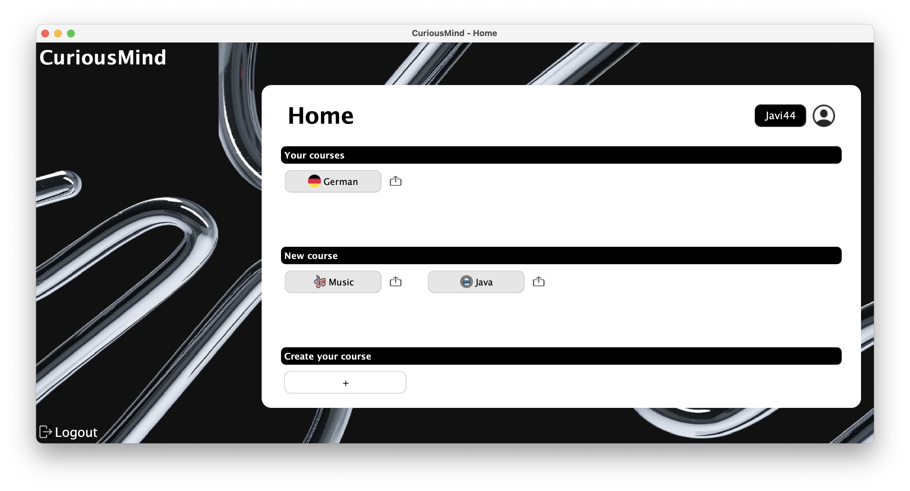

# 📘 User Manual — CuriousMind

## Table of Contents

1. [What is CuriousMind?](#what-is-curiousmind)
2. [System Requirements](#system-requirements)
3. [Installation and Launch](#installation-and-launch)
4. [Main Screens](#main-screens)
   - [1. Login Window](#1-login-window)
   - [2. Signup Window](#2-signup-window)
   - [3. Home Window](#3-home-window)
   - [4. UserInfo Window](#4-userinfo-window)
   - [5. Course Dashboard)](#5-course-dashboard)
   - [6. Question Window](#6-question-window)
5. [App Functionality](#app-functionality)
   - [1. How to create an account](#1-how-to-create-an-account)
   - [2. How to log in](#2-how-to-log-in)
   - [3. How to create a course](#3-how-to-create-a-course)
   - [4. How to share a course](#4-how-to-share-a-course)
   - [5. How to enroll in a course](#5-how-to-enroll-in-a-course)
6. [Course Workflow](#course-workflow)
7. [Frequently Asked Questions](#frequently-asked-questions)
8. [Contact and Support](#contact-and-support)

---

## What is CuriousMind?

CuriousMind is a desktop application aimed at users of all ages, designed to help them learn or reinforce knowledge across a wide variety of subjects. The application is organized into different courses, which can be either default courses provided by the CuriousMind developers or custom courses created by the users themselves.

This is an interactive program that makes learning languages, music, history, or even programming languages much more visual and engaging than simply reading books or searching for information online. It includes different types of questions such as multiple-choice tests, fill-in-the-gap exercises, visual games using flashcards, and even translation questions for language learning — all of which make the learning process more dynamic and enjoyable. 

---

## System Requirements

- Operative System: (ej. Windows / macOS / Linux)
- Java version: 21 
- IntelliJ IDEA (si se ejecuta desde código fuente)
- Maven Versión:  3.x y 4.x

---

## Installation and Launch

//TODO

---

## Main Screens

### 1. LogIn Window

LogIn window shows the login form, which consists of a login name (*username*) and a password (*password*). We have included the option to make the password visible to avoid errors or mistakes when writing (*show password*).
It incorporates two different buttons:

   - Log in: Once the form is completed, it is clicked to access the app's main menu.
   - Sign up: If it is the first time acceding CuriousMind, it is clicked to create our account from scratch. 

📸 Login Window 

As it can be seen in the image, this window also includes "extra" buttons in a top bar:

   - About us: It shows an info window about the developers team of CuriousMind. 
   - Contact: It indicates the different ways to countact us for any issue, from improvement to doubts. 
   - Log in: This button indicates that LogIn Window is active. 

📸 About Us and Contact Windows

  
  

---

### 2. SignUp Window

SignUp Window shows the creating account form , which consists of a full name (*fullname*), a login name (*username*), an email address (*email address*) and password (*password* and *confirm password*). Keeping the "show password" option, we have now included it doubled, due to the fact of having two password fields: choose and confirm. 

It incorporates two different buttons: 

   - Create Account: Once the form is filled, it is clicked to create the account, saving it in the data base. When clicking it, you will be redirected to LogIn window to login with your new credentials.
   - Log in: If you already had an account, you can click this button to go back to LogIn window and login normally with your credentials. 

📸 SignUp Window 

It mantains the previously commented buttons of the top bar, with a slight difference in the third one: 

   - Sign Up: This button indicates that SignUp Window is active.

---

### 3. Home Window

Home Window acts like the main menu of the app, being divided in three principal sections: 

- *My Courses*: Where the list of the courses we are registered appears, having both the options to access them clicking and share them. 
- *New Course*: Where all the app's courses are found, providing the posibility to share them or registrer ourselves on them. 
- *Create New Course*: This section allows to create a course through the import of it. 

👉 For more details, consult [How to Create a Course](#3-how-to-create-a-course).

👉 For more details, consult [How to Share a Course](#4-how-to-share-a-course).

  📸 Home Window 

On the other side, clicking the username or profile picture, we will be redirected to *UserInfo Window*. Also, the *Logout* button , as usual, allows to LogOut and redirects to *LogIn* Window.

  📸 Home Window with User Button 

---

### 4. UserInfo Window

UserInfo Window shows information about the user once Logging in. It offers a personalized welcome with the username.  

This window divides its information in two main sections:

**1. Your courses:**  
Here you can see the courses in which the user is already registered. It also includes a visual progress bar that indicates the advance in the course.

**2. Your stats:**  
Use statistics of the app, distributed in four key metrics: 
- 🏆 Best streak: longest use period (in days).
- 📅 Days of use: total number of days using the app.
- ✅ Completed courses: amount of courses finished by the user.
- ⏱ Time of use: total use time accumulate (in minutes)

Moreover, it incorporates a navigation button in the inferior left corner to go back to main menu with the text **Home** .

  📸 UserInfo Window 

---

### 5. Course Dashboard

Each course's Course Dashboard has a header with its title and image along with its content blocks. 

It should be pointed out that those content blocks that have already been completed by the user will change their appearance being coloured in green. This implies that the user cannot repeat a completed content block. 

📸 Course Dashboard 

It also incorporates the **Home**  button. 

---

### 6. Question Window

This window refers to an interactive exercise in the selected course. It can be of multiple types, such as **Translation**, **Fill the Gaps**, **Test** or **Flash Cards**.

---

   **1. Translate Question Window**

This first question's objective is that the user translates a sentence with given words as options. 

📸 Translate Question Window 

Main elements:

- The current language (German) appears at the top, along with the corresponding flag.
- Topic section: displays the current topic being studied, that is, the name of the selected content block.
- Instruction and prompt indicating what needs to be done.
- Answer area: section where the user must construct the correct sentence by selecting words from multiple options.

📸 Translate Answer Window 
  
- **Submit** button at the end to check if the answer is correct or not.

📸 Fail and Success Windows

  
  

The **Exit**  button now allows to go back to the Course Dashboard. 

---

**2. FillTheGap Question Window**

This question's objective is to correctly complete an english sentence by introducing the missing word. 

📸 FillTheGap Question Window 

Main elements:

- The current language (German) appears at the top, along with the corresponding flag.
- Topic section: displays the current topic being studied, that is, the name of the selected content block.
- Instruction and prompt indicating what needs to be done.
- Answer area: text field where the user must write the missing word. 

📸 FillTheGap Answer Window 

- **Submit** button at the end to check if the answer is correct or not.

📸 Fail and Success Windows

  
  

The **Exit**  button still allows to go back to the Course Dashboard. 

---

**3. FlashCard Question Window**

Its main objective is to correctly identify a vocabulary's word represented as an image.

📸 FlashCard Question Window 

Main elements: 

- The current language (German) appears at the top, along with the corresponding flag.
- Topic section: displays the current topic being studied, that is, the name of the selected content block.
- Instruction and prompt indicating what needs to be done.
- Answer area: three images corresponding to the possible options with their names.
- The user must choose the image that represents the correct word.

📸 Flashcard Answer Question 
  
- **Submit** button at the end to check if the answer is correct or not.

📸 Fail and Success Windows

  
  

The **Exit**  button mantains its functionality. 

---

**4. Test Question Window**

This window question's objective is that the user answers to a test question by selecting the correct test answer.

📸 Test Question Window 

Main elements: 

- The current language (German) appears at the top, along with the corresponding flag.
- Topic section: displays the current topic being studied, that is, the name of the selected content block.
- Instruction and prompt indicating what needs to be done.
- Answer area: answer options, from which the user must select the correct one.

📸 Test Answer Window 
  
- **Submit** button at the end to check if the answer is correct or not.

📸 Fail and Success Windows

  
  

The **Exit**  button mantains its functionality. 

---

## App Functionality

### 1. How to create an account

To signup in CuriousMind and start using the app, follow these steps:

1. Open the app and go to **Sign Up** Window.
2. Fill the required fields:
   - Your **full name**  
   - Your **user name**  
   - Your **email address**  
   - Your **password**  
   - Introduce your **password** again to confirm it (it must coincide with the previous one).  
3. Click **"Sign Up"** button.

📸 SignUp Window 

Once the register is completed, you will be redirected automatically to **Login** Window to introduce your credentials and access the app. 

---
### 2. How to Log In

To access your account in CuriousMind, follow these steps:

1. Open the application.  
2. On the **Login** screen, enter your **username** and **password** in the corresponding fields.  
3. Click the **"Login"** button to enter the application.  

📸 Login Screens (with and without hidden password)  

  
  

Once you have logged in successfully, you will enter the **Home** window, where you can view your courses, create new ones, or enroll in existing ones.

---

### 3. How to Create a Course

To create a course, CuriousMind allows you to import a `.json` file (containing the course)  
from your file explorer. To do so:

1. Go to the **Home** window.  
2. Click the **"+"** button located at the bottom of the *"Create your Course"* section.  

📸 Import Course Button 

3. A window like the following will open:  

📸 Import Course 

4. Add the `.json` file and click **Accept**.  

Once these steps are completed, the application will create the new course and display it in the *"New Course"* section.

---

### 4. How to Share a Course

To share a course, CuriousMind allows you to save a `.json` file (containing the course)  
to your file explorer. To do so:

1. Go to the **Home** window or the User Information window.  
2. Click the  button to the right of each course button.  

📸 Share Button  

3. A window will open with your file explorer, and you will be able to save the course file.  
4. Choose the destination folder and click **Save**.  

Once these steps are completed, the course will be saved on your local system, and you will be able to share it with other users.

---

### 5. How to Enroll in a Course

To enroll in a course you haven’t enrolled in yet, CuriousMind allows you to choose from the courses  
already created in the app and participate in them. To do so:

1. Go to the **Home** window.  
2. Click any of the course buttons in the *"New Course"* section.  

📸 Course Button 

3. A window like the following will open, where you must choose the strategy you want to follow for the course:  

📸 Strategy Window   

   The strategies allow you to customize how the questions appear. You can choose:
   - **Sequential**: questions appear one after another in normal order.  
   - **Random**: questions appear in a different order each time you enter the course’s content blocks.  
   - **Spaced Repetition**: every 3 questions, the first one is repeated to reinforce learning.

4. Once you have chosen the strategy, click the **Accept** button and you will be redirected to the Home window.

📸 Selected Strategy   

Once these steps are completed, the course will be available in the *"My Courses"* section in both the Home window and the User window.

---

## Course Workflow

### 6. How to Complete a Course

Once you’ve enrolled in a course, it’s time to complete it! ✅ To do so, you need to finish **all the content blocks** that make up the course and correctly answer **all the questions** in each block.

To complete a course, follow these steps:

1. Go to the **Home** window or the **UserWindow**.
2. In the *"My Courses"* section, click the button for the course you want to continue.  

📸 Enrolled Course  

3. You will be taken to the **CourseDashboard** window, where you can view all available content blocks.  
Click on one of them to start.  

📸 Content Blocks  

---

### ⛔ Life System

When you start a block, you begin with **5 lives ❤️❤️❤️❤️❤️**. This means you can get up to **4 questions wrong**.  
- If you miss a fifth question ❌, you will be **kicked out** of the block and will need to **start it from the beginning**.
- In addition, any questions you get wrong while completing a block will be **repeated at the end** to reinforce the content.

📌 *Be careful! Every mistake counts.*

---

### 🔄 Exiting a Block Midway

If you decide to exit a block before finishing it (by closing the app or returning to the course menu):  
- **Your current progress will be lost**, and **when you re-enter that block, you will start from the beginning**.  

🔁 *It’s better to finish what you start before exiting the block.*

---
### 🧠 Question Types and Order

- The **question type** within each block is **random**: you may be asked to translate, fill in the blanks, choose a Flashcard, or answer a quiz.  
- The **question order** depends on the **strategy you chose** when enrolling in the course:
  - **Sequential** ➡️ questions appear in order.
  - **Random** 🔀 ➡️ each attempt presents the questions in a different order.
  - **Spaced Repetition** ♻️ ➡️ reinforces learning by repeating questions.

---
### 🎯 Points, Difficulty, and Levels

Each content block has an assigned **difficulty** level (easy, medium, hard).  
- When you complete a block, you will earn **points** based on its difficulty:
  - Easy ⭐ → 100 points
  - Medium ⚙️ → 300 points
  - Hard 🔥 → 500 points

🏆 Points help you **increase your student level** in CuriousMind. The more blocks you complete, the higher your level will be **(1 level = 100 points)**.

---

For each content block you complete **without running out of lives**, the block will be marked as **completed** 🎉. You will not be able to repeat it, and it will appear in green in the course menu.

📸 Completed Course  

---
## Testing

### 🧪 Test Database

CuriousMind includes a test database designed to verify the correct functioning of the application in the following directory. It contains realistic examples of the app’s workflow, ideal for functional testing, located in the folder: [Cursos de Prueba](src/..DDBB....TODO). . In addition, the application has 2 default courses that will be imported in case the user has an empty database when running int he directory ....samplescouses...TODO 

---

### 📚 Available Courses in the Database

There are **5 predefined courses** in the database, each designed with different levels of difficulty and all types of questions. They are briefly described below:

1. **German Course 🇩🇪**  
   Includes content blocks that will help you build a solid foundation in the language.  
   The selected strategy for this course is random.

2. **C++ Course 💻**  
   Focused on fundamental coding blocks.  
   The selected strategy for this course is spaced repetition.

3. **Music 🎵**  
   Includes various blocks covering music history and fundamentals.  
   The selected strategy for this course is sequential repetition.

4. **Science and Nature Course 🔬**  
   Divided into blocks by topic (biology, physics, ecology…).  
   The selected strategy for this course is sequential repetition.

5. **Mathematics Course 📐**  
   Contains blocks focused on logic, calculus, and problem solving.  
   The selected strategy for this course is sequential repetition.

---
### 👤 Test User in the Database

An **example user** is included with the following status:

- Username: CuriousUser10
- Password: CuriousPassword10
  
- Enrolled in **3 courses** (German, Music, and C++).
- Has **completed 1 course ✅**.

---

## Frequently Asked Questions

**Does the app automatically save my progress?**  
Yes, all your progress is saved automatically. In addition, the app tracks the time you log in each day to record your statistics.

**If I exit a content block that I had started, will it resume from where I left off when I return?**  
No, if you exit a content block in progress, as with most interactive learning apps, you will need to start that block again.

**Can I enroll again in a course I’m already enrolled in?**  
No, once you are enrolled in a course, it appears in the *"My Courses"* section and you cannot enroll in it again.

**Can I repeat a content block that I have already completed?**  
No, once you successfully complete a content block in a course, it cannot be repeated and will be marked in green on the course’s main screen.

---

## Contact and Support

For any doubt, suggest or error report, you can contact the developer team writing to:
📧 CuriousMind@gmail.com

---

