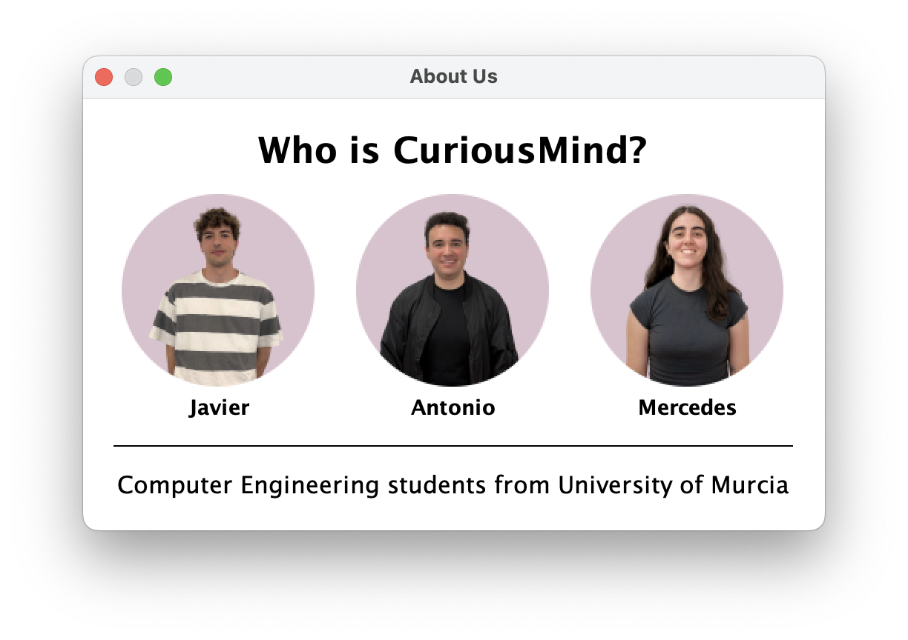
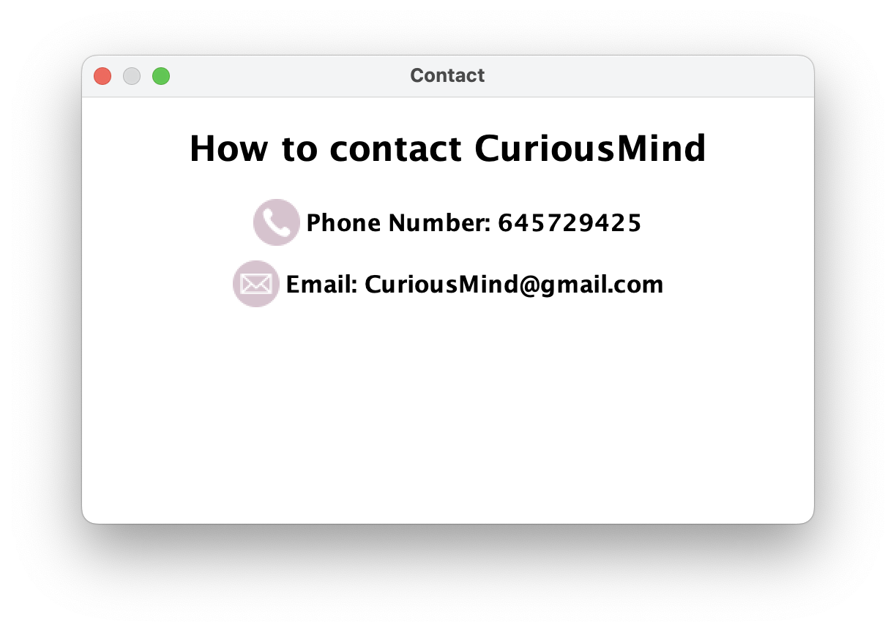

# 📘 Manual de Usuario — CuriousMind

## Índice

1. [¿Qué es CuriousMind?](#qué-es-curiousmind)
2. [Requisitos del sistema](#requisitos-del-sistema)
3. [Instalación y ejecución](#instalación-y-ejecución)
4. [Pantallas principales](#pantallas-principales)
   - [1. Pantalla de Inicio de sesión (Login)](#1-pantalla-de-inicio-de-sesión-login)
   - [2. Registro de usuario (Signup)](#2-registro-de-usuario-signup)
   - [3. Página principal (Home)](#3-página-principal-home)
   - [4. Vista de curso](#4-vista-de-curso)
   - [5. Bloques de contenido y preguntas](#5-bloques-de-contenido-y-preguntas)
   - [6. Perfil y estadísticas](#6-perfil-y-estadísticas)
5. [Cómo crear un curso](#cómo-crear-un-curso)
6. [Preguntas frecuentes](#preguntas-frecuentes)
7. [Contacto y soporte](#contacto-y-soporte)

---

## ¿Qué es CuriousMind?

CuriousMind es una aplicación de escritorio dirigida a todo tipo de público cuyo objetivo es dar servicio a los usuarios para aprender o reforzar contenidos sobre cualquier tipo de ámbito. La aplicaión se estructura en cursos diferentes, que podrán ser cursos por defecto proporcionados por los desarrolladores de CuriousMind, o cursos propios creados por el usuario. 

Esta aplicación es un programa interactivo que hace que aprender idiomas, música, historia o incluso lenguajes de programación sea mucho más visual y entretenido que simplemente leer libros o buscar información online. Cuenta con distintos tipos de preguntas como tipo test, preguntas de rellenar huecos, juegos visuales con flashcards o incluso preguntas de traducción para los idiomas, que harán que el aprendizaje se convierta en algo más dinámico y divertido. 

---

## Requisitos del sistema

- Sistema operativo: (ej. Windows / macOS / Linux)
- Java: Versión XX o superior
- IntelliJ IDEA (si se ejecuta desde código fuente)
- Maven: Versión XX

---

## Instalación y ejecución

1. Clona o descarga el repositorio.
2. Abre el proyecto en IntelliJ IDEA.
3. Ejecuta la clase `App.java`.
4. Se abrirá la interfaz principal de la aplicación.

---

## Pantallas principales

### 1. Pantalla de Inicio de sesión (Login)

La pantalla Login muestra el formulario de inicio de sesión, el cual consta de nombre de usuario (*username*) y contraseña (*password*). Hemos añadido la opción de "mostrar contraseña" para evitar fallos o errores al escribir (*show password*).
Incorpora dos botones diferentes:

   - Log in: Una vez relleno el formulario, se pulsa este botón para acceder al menú principal de la aplicación
   - Sign up: Si es la primera vez que accedemos a CuriousMind, se pulsa este botón para crear nuestra cuenta desde cero. 

📸 Ventana LogIn 

Como se observa en la imagen, esta ventana incluye además botones "extra" a modo de barra superior:

   - About us: Muestra una ventana de información acerca del equipo de desarrollo de CuriousMind.
   - Contact: Indica las diferentes formas de contactarnos para cualquier tema, ya sea sobre mejoras, sobre dudas...
   - Log in: Este botón indica que nos encontramos en la ventana Log in.

📸 Ventana About Us 
📸 Ventana Contact 

---

### 2. Registro de usuario (Signup)

La ventana Signup muestra el formulario de creación de cuenta, el cual consta de nombre de usuario (*username*) y contraseña (*password*). Hemos añadido la opción de "mostrar contraseña" para evitar fallos o errores al escribir (*show password*).
Incorpora dos botones diferentes:

📸 *[Captura del formulario de registro]*

---

### 3. Página principal (Home)

- Visualiza los cursos disponibles.
- Accede a tus cursos inscritos.
- Botón para **crear un nuevo curso**.

📸 *[Captura de la pantalla principal]*

---

### 4. Vista de curso

- Muestra los bloques de contenido del curso.
- Puedes avanzar bloque a bloque.

📸 *[Captura del curso en ejecución]*

---

### 5. Bloques de contenido y preguntas

- Lee el contenido del bloque.
- Contesta preguntas tipo test para avanzar.

📸 *[Ejemplo de una pregunta]*

---

### 6. Perfil y estadísticas

- Consulta tu progreso por curso.
- Visualiza número de preguntas acertadas, cursos completados, etc.

📸 *[Captura de la vista de perfil]*

---

## Cómo crear un curso

1. En la pantalla principal, haz clic en **“Crear curso”**.
2. Introduce el nombre del curso, descripción y bloques de contenido.
3. Añade preguntas por cada bloque si lo deseas.
4. Guarda el curso y compártelo con otros usuarios.

---

## Preguntas frecuentes

**¿Puedo editar un curso después de crearlo?**  
(Sí / No / En desarrollo...)

**¿Puedo eliminar mi cuenta?**  
(Sí, desde el perfil...)

**¿La app guarda mi progreso automáticamente?**  
(Sí / No...)

---

## Contacto y soporte

Para dudas, sugerencias o errores, puedes contactar con el equipo de desarrollo en:  
📧 correo@ejemplo.com

---

