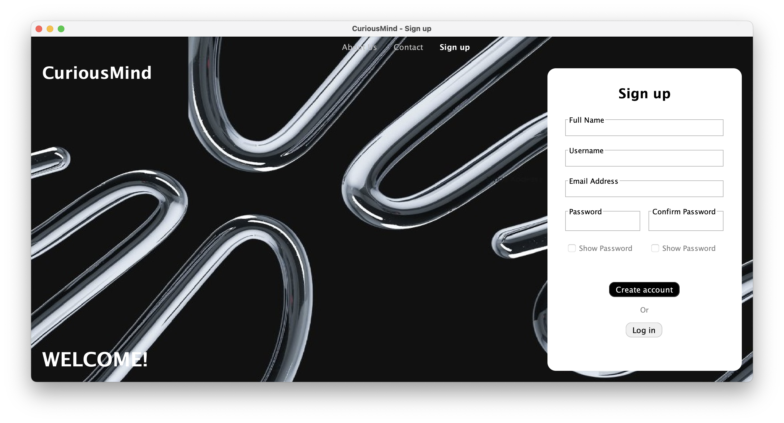
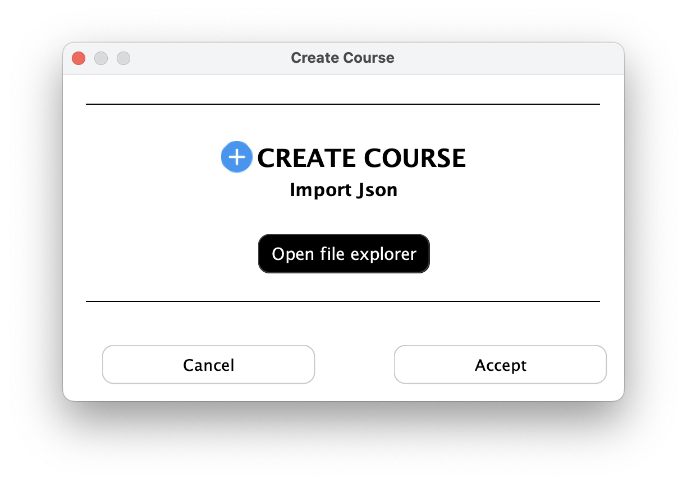
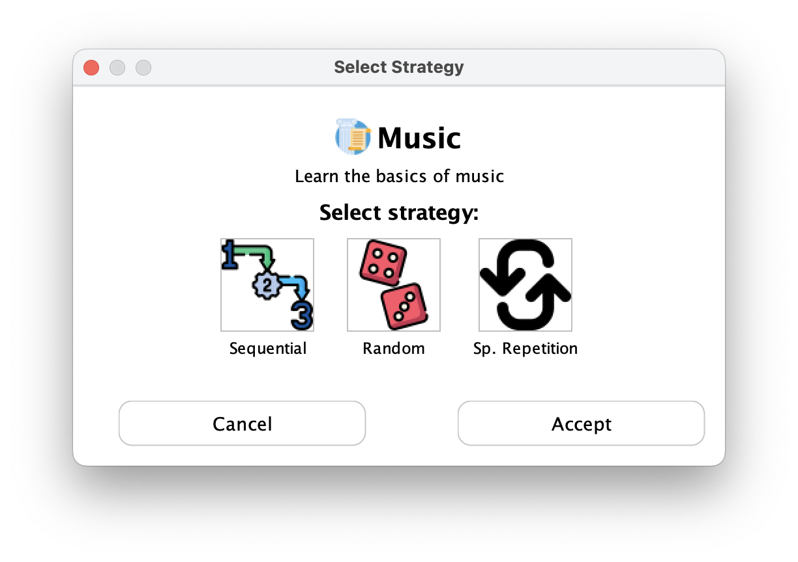
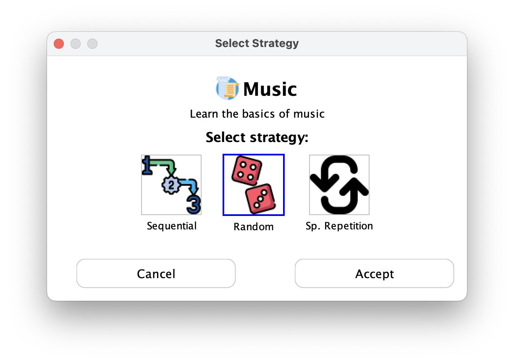

# 📘 Manual de Usuario — CuriousMind

## Índice

1. [¿Qué es CuriousMind?](#qué-es-curiousmind)
2. [Requisitos del sistema](#requisitos-del-sistema)
3. [Instalación y ejecución](#instalación-y-ejecución)
4. [Pantallas principales](#pantallas-principales)
   - [1. Pantalla de Inicio de sesión (Login)](#1-pantalla-de-inicio-de-sesión-login)
   - [2. Registro de usuario (Signup)](#2-registro-de-usuario-signup)
   - [3. Página principal (Home)](#3-página-principal-home)
   - [4. Vista de curso](#4-vista-de-curso)
   - [5. Bloques de contenido y preguntas](#5-bloques-de-contenido-y-preguntas)
   - [6. Perfil y estadísticas](#6-perfil-y-estadísticas)
5. [Cómo crear un curso](#cómo-crear-un-curso)
6. [Preguntas frecuentes](#preguntas-frecuentes)
7. [Contacto y soporte](#contacto-y-soporte)

---

## ¿Qué es CuriousMind?

CuriousMind es una aplicación de escritorio dirigida a todo tipo de público cuyo objetivo es dar servicio a los usuarios para aprender o reforzar contenidos sobre cualquier tipo de ámbito. La aplicaión se estructura en cursos diferentes, que podrán ser cursos por defecto proporcionados por los desarrolladores de CuriousMind, o cursos propios creados por el usuario. 

Esta aplicación es un programa interactivo que hace que aprender idiomas, música, historia o incluso lenguajes de programación sea mucho más visual y entretenido que simplemente leer libros o buscar información online. Cuenta con distintos tipos de preguntas como tipo test, preguntas de rellenar huecos, juegos visuales con flashcards o incluso preguntas de traducción para los idiomas, que harán que el aprendizaje se convierta en algo más dinámico y divertido. 

---

## Requisitos del sistema

- Sistema operativo: (ej. Windows / macOS / Linux)
- Java: Versión XX o superior
- IntelliJ IDEA (si se ejecuta desde código fuente)
- Maven: Versión XX

---

## Instalación y ejecución

1. Clona o descarga el repositorio.
2. Abre el proyecto en IntelliJ IDEA.
3. Ejecuta la clase `App.java`.
4. Se abrirá la interfaz principal de la aplicación.

---

## Pantallas principales

### 1. Pantalla de Inicio de sesión (Login)

La pantalla Login muestra el formulario de inicio de sesión, el cual consta de nombre de usuario (*username*) y contraseña (*password*). Hemos añadido la opción de "mostrar contraseña" para evitar fallos o errores al escribir (*show password*).
Incorpora dos botones diferentes:

   - Log in: Una vez relleno el formulario, se pulsa este botón para acceder al menú principal de la aplicación
   - Sign up: Si es la primera vez que accedemos a CuriousMind, se pulsa este botón para crear nuestra cuenta desde cero. 

📸 Ventana LogIn 

Como se observa en la imagen, esta ventana incluye además botones "extra" a modo de barra superior:

   - About us: Muestra una ventana de información acerca del equipo de desarrollo de CuriousMind.
   - Contact: Indica las diferentes formas de contactarnos para cualquier tema, ya sea sobre mejoras, sobre dudas...
   - Log in: Este botón indica que nos encontramos en la ventana Log in.

📸 Ventana About Us 
📸 Ventana Contact 

---

### 2. Registro de usuario (Signup)

La ventana Signup muestra el formulario de creación de cuenta, el cual consta de nombre completo (*fullname*), nombre de usuario (*username*), dirección de correo electrónico (*email address*) y contraseña (*password* y *confirm password*). Manteniendo la opcion de "mostrar contraseña", en esta ventana la incorporamos por duplicado, al tener dos campos de contraseña: elegir y confirmar. 
Incorpora dos botones diferentes:

   - Create Account: Una vez relleno el formulario, se pulsa este botón para crear la cuenta almacenándola en la base de datos. Al hacer click sobre este botón, se te redirigirá a la ventana LogIn para iniciar sesión con tus nuevos datos.
   - Log in: Si ya tenías una cuenta, puedes pulsar sobre este botón para volver a la ventana LogIn e iniciar sesión con tus datos. 

📸 Ventana SignUp 

Mantiene los botones comentados anteriormente de la barra superior, con la ligera diferencia del tercero: 

   - Sign Up: Este botón indica que nos encontramos en la ventana Sign Up.

---

### 3. Página principal (Home)

- Visualiza los cursos disponibles.
- Accede a tus cursos inscritos.
- Botón para **crear un nuevo curso**.

📸 *[Captura de la pantalla principal]*

---

### 4. Vista de curso

- Muestra los bloques de contenido del curso.
- Puedes avanzar bloque a bloque.

📸 *[Captura del curso en ejecución]*

---

### 5. Bloques de contenido y preguntas

- Lee el contenido del bloque.
- Contesta preguntas tipo test para avanzar.

📸 *[Ejemplo de una pregunta]*

---

### 6. Perfil y estadísticas

- Consulta tu progreso por curso.
- Visualiza número de preguntas acertadas, cursos completados, etc.

📸 *[Captura de la vista de perfil]*

---

## Cómo crear una cuenta

Para registrarte en CuriousMind y comenzar a utilizar la aplicación, sigue estos pasos:

1. Abre la aplicación y dirígete a la pantalla de **Sign Up**.  
2. Rellena los siguientes campos obligatorios:
   - Tu **nombre completo**  
   - Tu **nombre de usuario**  
   - Tu **correo electrónico**  
   - Tu **contraseña**  
   - Vuelve a introducir la **contraseña** para confirmarla (debe coincidir con la anterior).  
3. Pulsa el botón **"Sign Up"**.  
   📸 *---imagen de la pantalla de registro---*  

Una vez completado el registro, serás redirigido automáticamente a la pantalla de **Login** para que introduzcas tus credenciales y accedas a la aplicación.

---

## Cómo iniciar sesión

Para acceder a tu cuenta en CuriousMind, sigue estos pasos:

1. Abre la aplicación.  
2. En la pantalla de **Login**, introduce tu **nombre de usuario** y tu **contraseña** en los campos correspondientes.  
3. Pulsa el botón **"Login"** para entrar en la aplicación.  
   📸 *---imagen de la pantalla de login---*  

Una vez iniciado sesión correctamente, accederás a la ventana **Home**, donde podrás ver tus cursos, crear nuevos o inscribirte en los existentes.

---

## Cómo crear un curso

Para crear un curso, CuriousMind te da la posibilidad de importar un archivo `.json` (con el curso en cuestión)  
desde tu explorador de archivos. Para ello:

1. Dirígete a la ventana **Home** (explicada en el apartado correspondiente).  
2. Pulsa el botón **"+"** que se encuentra en la parte inferior, en la sección *"Crear Tu Curso"*.  
   📸 *---imagen del botón---*  

3. Se abrirá una ventana como la siguiente:  
   📸 Importar Curso 

4. Añade el archivo `.json` y pulsa **Aceptar**.  

Una vez completados estos pasos, la aplicación creará el nuevo curso y lo mostrará en la sección *"Nuevo Curso"*.  

---

## Cómo compartir un curso

Para compartir un curso, CuriousMind te da la posibilidad de guardar un archivo `.json` (con el curso en cuestión)  
en tu explorador de archivos. Para ello:

1. Dirígete a la ventana **Home** (explicada en el apartado correspondiente) o la ventana de Información de Usuario.  
2. Pulsa el botón  que se encuentra a la derecha de cada botón de curso.  
   📸 *---imagen del botón---*  

3. Se abrirá una ventana con tu explorador de archivos y podrás guardar el fichero con el curso.  
4. Elige la carpeta destino y pulsa **Guardar**.  

Una vez completados estos pasos, el curso estará guardado en tu sistema local y podrás compartirlo con otros usuarios.

---

## Cómo inscribirse en un curso

Para incribirte en un curso al que no te has inscrito ya, CuriousMind te da la posibilidad de elegir entre los cursos  
ya creados en la aplicación y participar en ellos. Para ello:

1. Dirígete a la ventana **Home** (explicada en el apartado correspondiente).  
2. Pulsa el botón en cualquiera de los botones de cursos que se encuentran en la sección *"Nuevo Curso"*.  
   📸 *---imagen del botón---*  

3. Se abrirá una ventana como la siguiente en la cual debemos escoger la estrategia que queremos seguir en el curso:  
   📸 Ventana Estrategia 
 

   Las estrategias sirven para personalizar la forma de aparición de las preguntas, entre ellas tenemos:
   - **Secuencial**: donde las preguntas aparecen en orden normal una detrás de otra.  
   - **Aleatorio**: las preguntas aparecen desordenadas cada vez que entras a los bloques de contenidos del curso.  
   - **Repetición Espaciada**: cada 3 preguntas, la primera de esas tres se repite para afianzar los conocimientos.

4. Una vez elegida la estrategia, pulsa el botón **Aceptar** y serás redirigido a la ventana de Home.
   📸 Estrategia Seleccionada  

Una vez completados estos pasos, el curso estará accesible en la sección *"Mis Cursos"* tanto en la ventana Home como en la ventana de Usuario.

---

## Preguntas frecuentes

**¿Puedo editar un curso después de crearlo?**  
(Sí / No / En desarrollo...)

**¿Puedo eliminar mi cuenta?**  
(Sí, desde el perfil...)

**¿La app guarda mi progreso automáticamente?**  
(Sí / No...)

**¿Puedo volver a inscribirme en un curso del que ya estoy inscrito?**  
No, una vez que te has inscrito en un curso, este aparece en la sección *"Mis Cursos"* y no es posible volver a inscribirse nuevamente.  

---

## Contacto y soporte

Para cualquier duda, sugerencia o reporte de errores, puedes ponerte en contacto con el equipo de desarrollo escribiendo a:  
📧 CuriousMind@gmail.com

---

