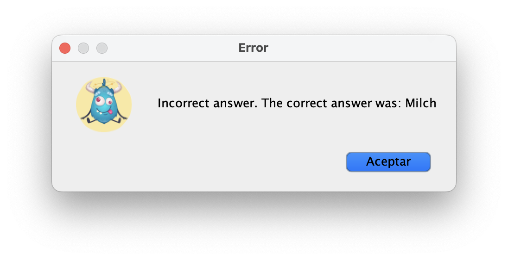

# 📘 Manual de Usuario — CuriousMind

## Índice

1. [¿Qué es CuriousMind?](#qué-es-curiousmind)
2. [Requisitos del sistema](#requisitos-del-sistema)
3. [Instalación y ejecución](#instalación-y-ejecución)
4. [Pantallas principales](#pantallas-principales)
   - [1. Pantalla de Inicio de sesión (Login)](#1-pantalla-de-inicio-de-sesión-login)
   - [2. Registro de usuario (Signup)](#2-registro-de-usuario-signup)
   - [3. Ventana Menu Principal (Home)](#3--ventana-menu-principal-home)
   - [4. Ventana Información de Usuario (UserWindow)](#4-ventana-información-de-usuario-userwindow)
   - [5. Ventana Principal del Curso (CourseDashboard)](#5-ventana-principal-del-curso-coursedashboard)
   - [6. Ventana Pregunta de Traducción (Translate)](#6--ventana-pregunta-de-traducción-translate)
   - [7. Ventana Pregunta de Rellenar Huecos (FillTheGap)](#7--ventana-pregunta-de-rellenar-huecos-fillthegap)
   - [8. Ventana Pregunta de Selección (FlashCard)](#8--ventana-pregunta-de-selección-flashcard)
   - [9. Ventana Pregunta tipo Test (Test)](#9--ventana-pregunta-tipo-test-test)
5. [Funcionalidad de la Aplicación](#funcionalidad-de-la-aplicación)
   - [1. Cómo crear una cuenta](#1-cómo-crear-una-cuenta)
   - [2. Cómo Iniciar Sesión](#2-cómo-iniciar-sesión)
   - [3. Cómo crear un curso](#3-cómo-crear-un-curso)
   - [4. Cómo compartir un curso](#4-cómo-compartir-un-curso)
   - [5. Cómo inscribirse en un curso](#5-cómo-inscribirse-en-un-curso)
7. [Funcionamiento de los Cursos](#funcionamiento-de-los-cursos)
8. [Preguntas frecuentes](#preguntas-frecuentes)
9. [Contacto y soporte](#contacto-y-soporte)

---

## ¿Qué es CuriousMind?

CuriousMind es una aplicación de escritorio dirigida a todo tipo de público cuyo objetivo es dar servicio a los usuarios para aprender o reforzar contenidos sobre cualquier tipo de ámbito. La aplicaión se estructura en cursos diferentes, que podrán ser cursos por defecto proporcionados por los desarrolladores de CuriousMind, o cursos propios creados por el usuario. 

Esta aplicación es un programa interactivo que hace que aprender idiomas, música, historia o incluso lenguajes de programación sea mucho más visual y entretenido que simplemente leer libros o buscar información online. Cuenta con distintos tipos de preguntas como tipo test, preguntas de rellenar huecos, juegos visuales con flashcards o incluso preguntas de traducción para los idiomas, que harán que el aprendizaje se convierta en algo más dinámico y divertido. 

---

## Requisitos del sistema

- Sistema operativo: (ej. Windows / macOS / Linux)
- Java version: 1.8.0 
- IntelliJ IDEA (si se ejecuta desde código fuente)
- Maven: Versión XX //TODO

---

## Instalación y ejecución //TODO

1. Clona o descarga el repositorio.
2. Abre el proyecto en IntelliJ IDEA.
3. Ejecuta la clase `App.java`.
4. Se abrirá la interfaz principal de la aplicación.

---

## Pantallas principales

### 1. Pantalla de Inicio de sesión (Login)

La pantalla Login muestra el formulario de inicio de sesión, el cual consta de nombre de usuario (*username*) y contraseña (*password*). Hemos añadido la opción de "mostrar contraseña" para evitar fallos o errores al escribir (*show password*).
Incorpora dos botones diferentes:

   - Log in: Una vez relleno el formulario, se pulsa este botón para acceder al menú principal de la aplicación
   - Sign up: Si es la primera vez que accedemos a CuriousMind, se pulsa este botón para crear nuestra cuenta desde cero. 

📸 Ventana LogIn 

Como se observa en la imagen, esta ventana incluye además botones "extra" a modo de barra superior:

   - About us: Muestra una ventana de información acerca del equipo de desarrollo de CuriousMind.
   - Contact: Indica las diferentes formas de contactarnos para cualquier tema, ya sea sobre mejoras, sobre dudas...
   - Log in: Este botón indica que nos encontramos en la ventana Log in.

📸 Ventanas About Us y Contact

  
  

---

### 2. Registro de usuario (Signup)

La ventana Signup muestra el formulario de creación de cuenta, el cual consta de nombre completo (*fullname*), nombre de usuario (*username*), dirección de correo electrónico (*email address*) y contraseña (*password* y *confirm password*). Manteniendo la opcion de "mostrar contraseña", en esta ventana la incorporamos por duplicado, al tener dos campos de contraseña: elegir y confirmar. 
Incorpora dos botones diferentes:

   - Create Account: Una vez relleno el formulario, se pulsa este botón para crear la cuenta almacenándola en la base de datos. Al hacer click sobre este botón, se te redirigirá a la ventana LogIn para iniciar sesión con tus nuevos datos.
   - Log in: Si ya tenías una cuenta, puedes pulsar sobre este botón para volver a la ventana LogIn e iniciar sesión con tus datos. 

📸 Ventana SignUp 

Mantiene los botones comentados anteriormente de la barra superior, con la ligera diferencia del tercero: 

   - Sign Up: Este botón indica que nos encontramos en la ventana Sign Up.

---

### 3.  Ventana Menu Principal (Home)

La pantalla *Home* actúa como el menú principal de la aplicación, esta ventana esta dividida en tres secciones principales:

- *My Courses*: Donde aparece el listado de los cursos en los que estamos inscritos teniendo la posibilidad de entrar en ellos clicando o compartirlos. 
- *New Course*: Donde se encuentran todos los cursos de la aplicación y tenemos la posibilidad de compartirlos e inscribirnos en ellos.
- *Create New Course*: Este apartado te permite crear un curso a partir de la importación del mismo.

👉 Para más detalles, consulta [Cómo crear un curso](#3-cómo-crear-un-curso).

👉 Para más detalles, consulta [Cómo compartir un curso](#4-cómo-compartir-un-curso).

  📸 Ventana Home 

Por otro lado, pulsando en la foto de perfil o en el nombre del usuario seremos redirigidos a la pantalla de *Información de Usuario*.
El botón *Logout* , como es habitual, permite cerrar la sesión y te redirige a la ventana de *Log In*.

  📸 Ventana Home Botón de User 

---

### 4. Ventana Información de Usuario (UserWindow)

La pantalla de *UserWindow* muestra información de usuario una vez iniciada sesión. Se presenta una bienvenida personalizada con el nombre del usuario junto con el nivel actual del usuario.

En esta ventana se divide la información en dos secciones principales:

**1. Your courses:**  
Aquí se muestran los cursos en los que el usuario está inscrito. Incluye también una barra de progreso visual que indica el avance en dicho curso.

**2. Your stats:**  
Estadísticas del uso de la aplicación, distribuidas en cuatro métricas clave:
- 🏆 Best streak: racha de uso más larga (en días).
- 📅 Days of use: número total de días en los que se ha utilizado la app.
- ✅ Completed courses: cantidad de cursos terminados por el usuario.
- ⏱ Time of use: tiempo total de uso acumulado.

Además, incorpora en la parte inferior izquierda un botón de navegación para volver al menú principal con el texto **Home** .

  📸 Ventana Información de Usuario 

---

### 5. Ventana Principal del Curso (CourseDashboard)

La pantalla principal de cada curso tiene una cabecera con el título y la imagen del mismo así como la lista de sus bloques de contenidos.
Cabe destacar que encontraremos de color verde los bloques de contenidos del curso que ya hayan sido completados por el usuario.
Esta diferenciación de color mencionada con anterioridad se debe a que el usuario no puede repetir un bloque de contenidos que ya ha sido completado.

📸 Ventana Home del Curso 

Además, incorpora en la parte inferior izquierda un botón de navegación para volver al menú principal con el texto **Home** .

---

### 6.  Ventana Pregunta de Traducción (Translate)

Esta pantalla corresponde a un ejercicio interactivo dentro del curso seleccionado. El objetivo principal es que el usuario traduzca una frase con palabras dadas como opciones.

📸 Ventana Pregunta Traducción 

Elementos principales:

- En la parte superior aparece el idioma actual (German), acompañado de la bandera correspondiente.
- Sección temática: muestra el tema que se está trabajando, es decir, el nombre del bloque de contenidos seleccionado.
- Enunciado e indicación de lo que hay que hacer.
- Zona de respuesta: área donde el usuario debe construir la frase correcta en seleccionando palabras entre múltiples opciones.

   📸 Ventana Pregunta Traducción 
  
- Botón **Submit** al final para comprobar si la respuesta es correcta o no.

📸 Ventanas Fallo y Acierto

  
  

En la parte inferior izquierda también se encuentra el botón **Exit** , que permite salir del ejercicio y volver al menú principal de un curso.

---

### 7.  Ventana Pregunta de Rellenar Huecos (FillTheGap)

Esta pantalla corresponde a un ejercicio interactivo dentro del curso seleccionado. El objetivo del ejercicio es completar correctamente una oración en inglés introduciendo la palabra que falta.

📸 Ventana Pregunta Rellenar Huecos 

Elementos principales de la interfaz:

- En la parte superior aparece el idioma actual (German), acompañado de la bandera correspondiente.
- Sección temática: muestra el tema que se está trabajando, es decir, el nombre del bloque de contenidos seleccionado.
- Enunciado e indicación de lo que hay que hacer.
- Debajo se encuentra una caja de texto vacía donde el usuario debe escribir la palabra que falta.

  📸 Ventana Pregunta Rellenar Huecos 

- Botón **Submit** al final para comprobar si la respuesta es correcta o no.

📸 Ventanas Fallo y Acierto

  
  

En la parte inferior izquierda también se encuentra el botón **Exit** , que permite salir del ejercicio y volver al menú principal de un curso.

---

### 8.  Ventana Pregunta de Selección (FlashCard)

Esta pantalla corresponde a un ejercicio interactivo dentro del curso seleccionado. El objetivo principal es identificar correctamente una palabra del vocabulario presentada en forma de imagen.

📸 Ventana Pregunta Flashcard 

Elementos destacados:

- En la parte superior aparece el idioma actual (German), acompañado de la bandera correspondiente.
- Sección temática: muestra el tema que se está trabajando, es decir, el nombre del bloque de contenidos seleccionado.
- Enunciado e indicación de lo que hay que hacer.
- Debajo aparecen tres imágenes correspondientes con sus correspondientes nombres.
- El usuario debe seleccionar la imagen que representa la palabra correcta.

  📸 Ventana Pregunta Flashcard 
  
- Botón **Submit** al final para comprobar si la respuesta es correcta o no.

📸 Ventanas Fallo y Acierto

  
  

En la parte inferior izquierda también se encuentra el botón **Exit** , que permite salir del ejercicio y volver al menú principal de un curso.

---

### 9.  Ventana Pregunta tipo Test (Test)

Esta pantalla corresponde a un ejercicio interactivo dentro del curso seleccionado. El objetivo principal es que el usuario responda una pregunta tipo test seleccionando la opción correcta.

📸 Ventana Pregunta Test 

Elementos destacados:

- En la parte superior aparece el idioma actual (German), acompañado de la bandera correspondiente.
- Sección temática: muestra el tema que se está trabajando, es decir, el nombre del bloque de contenidos seleccionado.
- Enunciado e indicación de lo que hay que hacer.
- Debajo aparecen las opciones de respuesta de entre las cuales el usuario debe seleccionar la respuesta correcta.

📸 Ventana Pregunta Test 
  
- Botón **Submit** al final para comprobar si la respuesta es correcta o no.

📸 Ventanas Fallo y Acierto

  
  

En la parte inferior izquierda también se encuentra el botón **Exit** , que permite salir del ejercicio y volver al menú principal de un curso.

---

## Funcionalidad de la Aplicación

### 1. Cómo crear una cuenta

Para registrarte en CuriousMind y comenzar a utilizar la aplicación, sigue estos pasos:

1. Abre la aplicación y dirígete a la pantalla de **Sign Up**.  
2. Rellena los siguientes campos obligatorios:
   - Tu **nombre completo**  
   - Tu **nombre de usuario**  
   - Tu **correo electrónico**  
   - Tu **contraseña**  
   - Vuelve a introducir la **contraseña** para confirmarla (debe coincidir con la anterior).  
3. Pulsa el botón **"Sign Up"**.

📸 Ventana SignUp 

Una vez completado el registro, serás redirigido automáticamente a la pantalla de **Login** para que introduzcas tus credenciales y accedas a la aplicación.

---

### 2. Cómo Iniciar Sesión

Para acceder a tu cuenta en CuriousMind, sigue estos pasos:

1. Abre la aplicación.  
2. En la pantalla de **Login**, introduce tu **nombre de usuario** y tu **contraseña** en los campos correspondientes.  
3. Pulsa el botón **"Login"** para entrar en la aplicación.  

📸 Ventanas Log in (con y sin contraseña oculta)

  
  

Una vez iniciado sesión correctamente, accederás a la ventana **Home**, donde podrás ver tus cursos, crear nuevos o inscribirte en los existentes.

---

### 3. Cómo crear un curso

Para crear un curso, CuriousMind te da la posibilidad de importar un archivo `.json` (con el curso en cuestión)  
desde tu explorador de archivos. Para ello:

1. Dirígete a la ventana **Home**.  
2. Pulsa el botón **"+"** que se encuentra en la parte inferior, en la sección *"Create your Course"*.  

📸 Botón Importar Curso 

3. Se abrirá una ventana como la siguiente:  

📸 Importar Curso 

4. Añade el archivo `.json` y pulsa **Accept**.  

Una vez completados estos pasos, la aplicación creará el nuevo curso y lo mostrará en la sección *"New Course"*.  

---

### 4. Cómo compartir un curso

Para compartir un curso, CuriousMind te da la posibilidad de guardar un archivo `.json` (con el curso en cuestión)  
en tu explorador de archivos. Para ello:

1. Dirígete a la ventana **Home** o la ventana de Información de Usuario.  
2. Pulsa el botón  que se encuentra a la derecha de cada botón de curso.  

📸 Botón Compartir  

3. Se abrirá una ventana con tu explorador de archivos y podrás guardar el fichero con el curso.  
4. Elige la carpeta destino y pulsa de **Guardar**.  

Una vez completados estos pasos, el curso estará guardado en tu sistema local y podrás compartirlo con otros usuarios.

---

### 5. Cómo inscribirse en un curso

Para incribirte en un curso al que no te has inscrito ya, CuriousMind te da la posibilidad de elegir entre los cursos  
ya creados en la aplicación y participar en ellos. Para ello:

1. Dirígete a la ventana **Home**.
2. Pulsa el botón en cualquiera de los botones de cursos que se encuentran en la sección *"New Course"*.  

📸 Botón de Curso 

3. Se abrirá una ventana como la siguiente en la cual debemos escoger la estrategia que queremos seguir en el curso:  

📸 Ventana Estrategia   //TODO CAMBIAR FOTO 
 

   Las estrategias sirven para personalizar la forma de aparición de las preguntas, entre ellas tenemos:
   - **Secuencial**: donde las preguntas aparecen en orden normal una detrás de otra.  
   - **Aleatorio**: las preguntas aparecen desordenadas cada vez que entras a los bloques de contenidos del curso.  
   - **Repetición Espaciada**: cada 3 preguntas, la primera de esas tres se repite para afianzar los conocimientos.

4. Una vez elegida la estrategia, pulsa el botón **Accept** y serás redirigido a la ventana de Home.

📸 Estrategia Seleccionada  //TODO CAMBIAR FOTO 

Una vez completados estos pasos, el curso estará accesible en la sección *"My Courses"* tanto en la ventana Home como en la ventana de Usuario.

## Funcionamiento de los Cursos

### 6. Cómo completar un curso

Una vez te hayas inscrito en un curso, ¡es hora de completarlo! ✅ Para ello, necesitas superar **todos los bloques de contenido** que componen el curso y responder correctamente a **todas las preguntas** de cada bloque.

Para completar un curso, sigue estos pasos:

1. Dirígete a la ventana **Home** o a la ventana **UserWindow**.
2. En la sección *"My Courses"*, pulsa el botón del curso que quieras continuar.  

📸 Curso Inscrito  

3. Serás llevado a la ventana del curso (**CourseDashboard**), donde podrás ver todos los bloques de contenido disponibles.  
Pulsa en uno de ellos para comenzar.  

📸 Bloques de Contenido  

---

### ⛔ Sistema de vidas

Al iniciar un bloque, comenzarás con **5 vidas ❤️❤️❤️**. Esto significa que puedes fallar hasta **3 preguntas**.  
- Si fallas una cuarta ❌, serás **expulsado** del bloque y tendrás que **empezar desde el principio** de ese bloque.

📌 *¡Ten cuidado! Cada fallo cuenta.*

---

### 🔄 Salirte a mitad de un bloque

Si decides salir del bloque antes de terminarlo (cerrando la app o saliendo al menú del curso):  
- **Perderás el progreso actual**, y **cuando vuelvas a entrar a ese bloque empezarás de cero**.  

🔁 *Es mejor terminar lo que empiezas antes de salir del bloque.*

---

### 🧠 Tipos de preguntas y orden

- El **tipo de pregunta** dentro de cada bloque es **aleatorio**: puede tocarte traducir, rellenar huecos, elegir la tarjeta Flashcard, o resolver un test.  
- El **orden de las preguntas** depende de la **estrategia que elegiste** al inscribirte en el curso:
  - **Secuencial** ➡️ preguntas en orden.
  - **Aleatorio** 🔀 ➡️ cada intento tiene orden distinto.
  - **Repetición Espaciada** ♻️ ➡️ se refuerzan conocimientos repitiendo preguntas.

---

### 🎯 Puntos, dificultad y niveles

Cada bloque tiene una **dificultad** asignada (fácil, medio, difícil).  
- Al completar un bloque, recibirás **puntos** en función de su dificultad:
  - Fácil ⭐ → 100 puntos
  - Medio ⚙️ → 300 puntos
  - Difícil 🔥 → 500 puntos

🏆 Los puntos te ayudan a **aumentar tu nivel como estudiante** en CuriousMind. Cuantos más bloques completes, más nivel tendrás **(1 nivel = 1000 puntos)**.

---

Por cada bloque de contenidos que completes **sin agotar tus vidas**, el bloque se marcará como **completado** 🎉, ya no lo podrás volver a hacer, y aparecerá de color verde en el menú del curso.

📸 Curso Completado  

---

## Preguntas frecuentes

**¿La app guarda mi progreso automáticamente?**  
Sí, todos tus cambios se guardan y además la aplicación es capaz de guardar el momento en el que te conectas cada día para poder registrar tus estadíticas.

**En caso de salir de un bloque de contenidos iniciado ¿Al volver a entrar recupero la pregunta por la que iba?**  
No, si sales de un bloque de contenidos iniciado, como en la mayoría de aplicaciones relacionadas con el aprendizaje interactivo, debes iniciar de nuevo ese bloque.

**¿Puedo volver a inscribirme en un curso del que ya estoy inscrito?**  
No, una vez que te has inscrito en un curso, este aparece en la sección *"Mis Cursos"* y no es posible volver a inscribirse nuevamente.  

**¿Puedo volver a realizar un bloque de contenidos que ya he completado?**  
No, una vez que completas con éxito un bloque de contenidos de un curso no se puede volver a hacer y quedará marcado en verde en la ventana principal del curso.

---

## Contacto y soporte

Para cualquier duda, sugerencia o reporte de errores, puedes ponerte en contacto con el equipo de desarrollo escribiendo a:  
📧 CuriousMind@gmail.com

---

